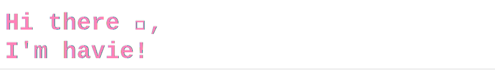

<!-- top of README: include the SVG header -->

## ✨ About me
- 🎏 I'm a Computer Science student at Grinnell College pursuing a concentration in Statistics.

## 🎡Learning & growth
- I’m currently learning Full-Stack Web Development and studying for professional certificates to improve my skills.
- I have experience working on data preprocessing and data visualization.
- I am actively looking to join a software engineering program or internship.

## 🪄Connect me
- [Email](havienguyen2007@gmail.com)
- [LinkedIn](https://www.linkedin.com/in/vynguyen2309/)

  

